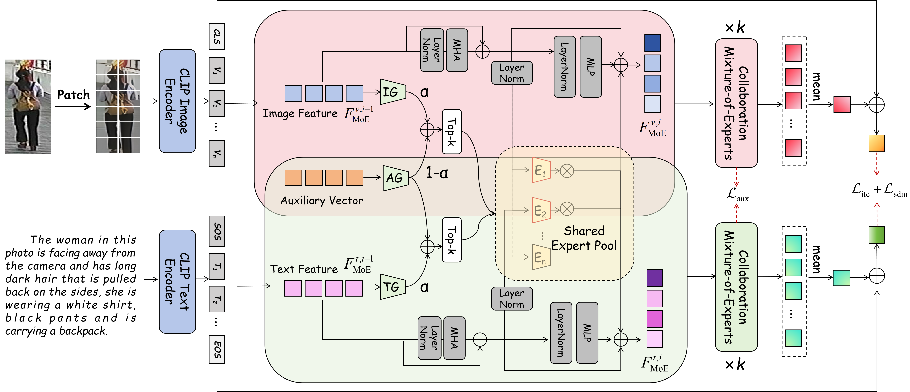

# CoMoE: Collaboration Mixture-of-Experts for Text-based Person Retrieval
[](https://github.com/anosorae/IRRA/blob/main/LICENSE) [](https://paperswithcode.com/sota/nlp-based-person-retrival-on-cuhk-pedes?p=cross-modal-implicit-relation-reasoning-and)

Official PyTorch implementation of the paper CoMoE: Collaboration Mixture-of-Experts for Text-based Person Retrieval.

## Updates
- 🔴 ***<ins>[(1/13/2026) Checking and Correction](https://github.com/Tedysu0916/php_V1/tree/main/Checking_and_Correction)</ins>***
- (12/31/2025) Revision V2 Code released!
- (9/28/2025) Revision V1 Code released!


## Highlights
In this paper, We propose collaboration mixture-of-experts (CoMoE) for TBPR, reframing alignment as a collaborative expert-routing process rather than mere feature similarity. Two core ideas underpin the approach: (1) Collaborative architecture (CoA): Visual patches and text tokens are routed to a shared expert pool through modality-specific and auxiliary gates, enabling semantically related cues to co-activate complementary experts and thereby achieve attribute-specific specialization while preserving coherent cross-modal behavior; (2) Collaboration-aware auxiliary regularization (CoAR): An auxiliary objective balances expert usage across modalities to prevent domination by a few experts and to promote joint capture of reusable semantics.



## Usage
### Requirements
we use single RTX3090 24G GPU for training and evaluation. 
```
pytorch 2.1.1
torchvision 0.16.1
prettytable
easydict
```

### Prepare Datasets
Download the CUHK-PEDES、ICFG-PEDES and RSTPReid dataset from [here](https://pan.baidu.com/s/1EtiFJBjjijhUD_mq5E1vMw?pwd=xvfy)

Organize them in `your dataset root dir` folder as follows:
```
|-- your dataset root dir/
|   |-- <CUHK-PEDES>/
|       |-- imgs
|            |-- cam_a
|            |-- cam_b
|            |-- ...
|       |-- reid_raw.json
|
|   |-- <ICFG-PEDES>/
|       |-- imgs
|            |-- test
|            |-- train 
|       |-- ICFG_PEDES.json
|
|   |-- <RSTPReid>/
|       |-- imgs
|       |-- data_captions.json
```

## Guidance of experiments

Please download the checkpoints files from [here](https://pan.baidu.com/s/18FNB_82-trYowkqsafKH4g?pwd=qwer) and then release them into ./logs, as follows. 
```
|-- logs/
|   |-- <CUHK-PEDES>/
|       |-- sdm+itc+aux_lr3e-06_test
|           |--best.pth
|           |--configs.yaml
|
|   |-- <ICFG-PEDES>/
|       |-- sdm+itc+aux_lr3e-06_test
|           |--best.pth
|           |--configs.yaml
|
|   |-- <RSTPReid>/
|       |-- sdm+itc+aux_lr3e-06_test
|           |--best.pth
|           |--configs.yaml
```

### Reproducing Results
To verify and reproduce our experimental results, simply modify the config file path in the testing command:
```
CUDA_VISIBLE_DEVICES=0 \
python test.py \
--config_file 'xxxx.yaml'
```


## Acknowledgments
Some components of this code implementation are adopted from [CLIP](https://github.com/openai/CLIP), [IRRA](https://github.com/anosorae/IRRA), [DM-Adapter](https://github.com/Liu-Yating/DM-Adapter). We sincerely appreciate for their contributions.


[//]: # (## Citation)

[//]: # (If you find this code useful for your research, please cite our paper.)

[//]: # ()
[//]: # (```tex)

[//]: # (@inproceedings{cvpr23crossmodal,)

[//]: # (  title={Cross-Modal Implicit Relation Reasoning and Aligning for Text-to-Image Person Retrieval},)

[//]: # (  author={Jiang, Ding and Ye, Mang},)

[//]: # (  booktitle={IEEE International Conference on Computer Vision and Pattern Recognition &#40;CVPR&#41;},)

[//]: # (  year={2023},)

[//]: # (})

[//]: # (```)

## Contact
If you have any question, please feel free to contact us. E-mail: [jiajunsu@hqu.edu.cn](mailto:jiajunsu@hqu.edu.cn).
